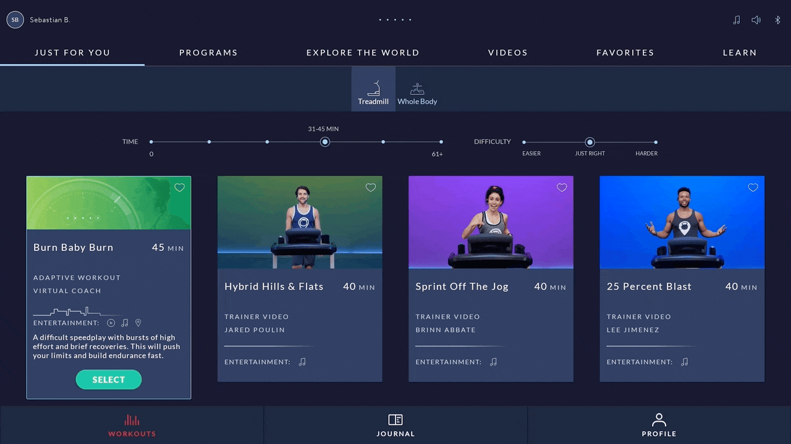
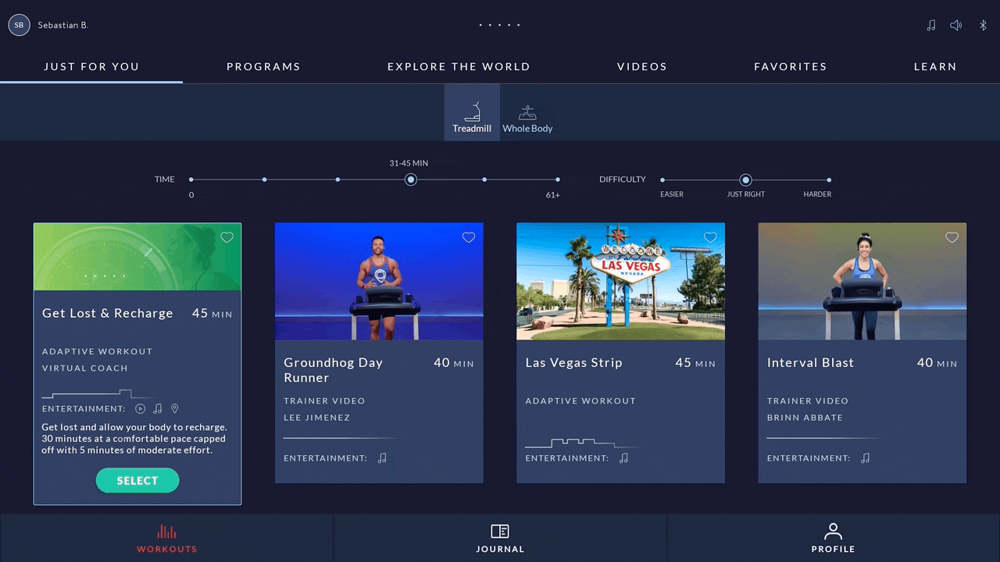
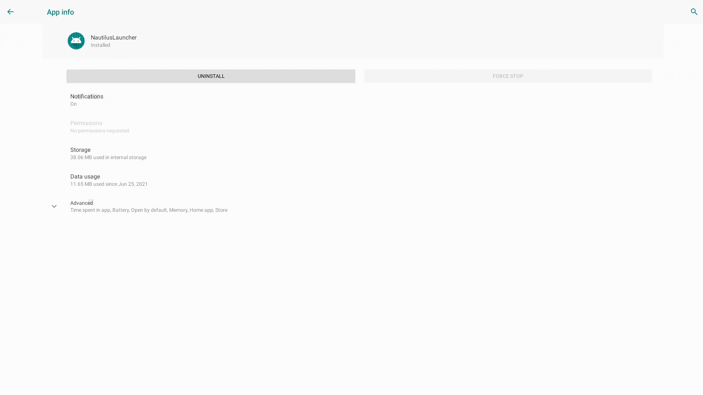
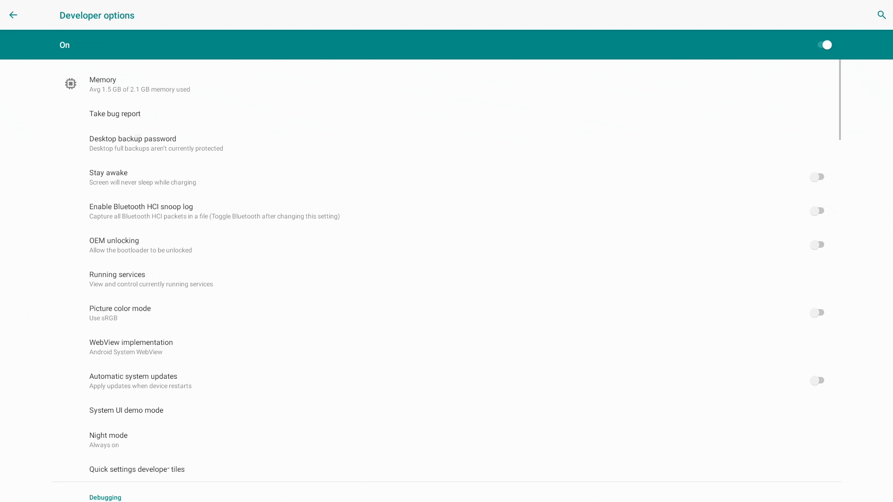
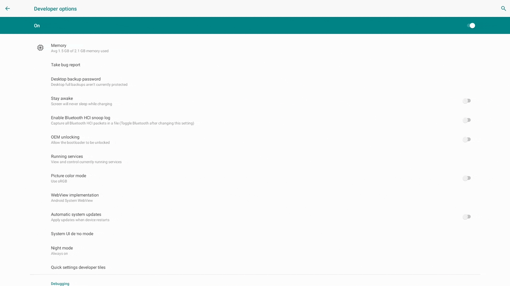
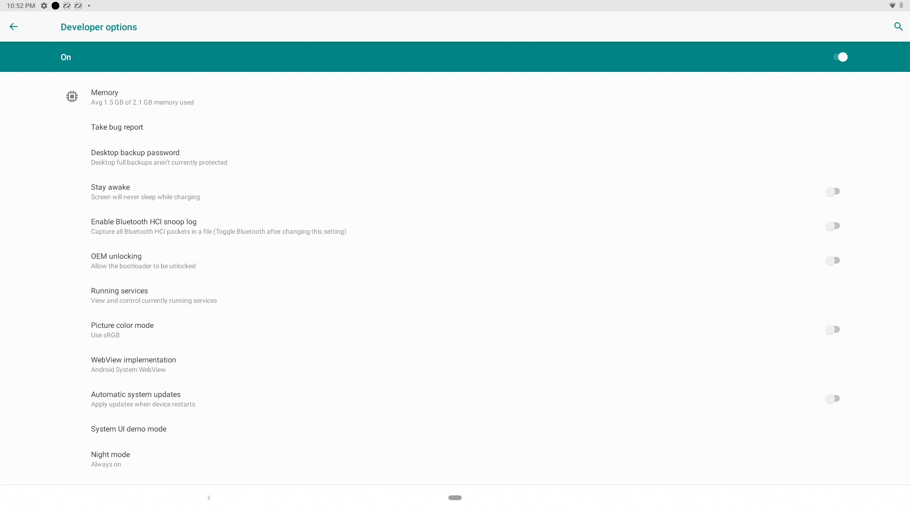
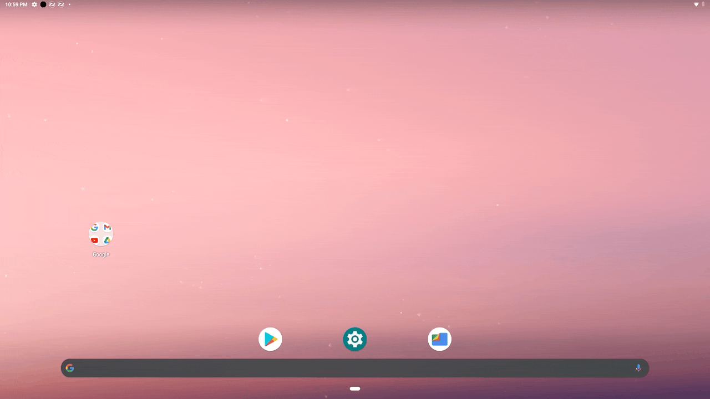

<p align="center">
  
</p>

## Android Jailbreak | fl3xbl0w

This method relies on the Bowflex Console specs being too slow for nowadays' software (it only has 2Gb of RAM on the Android board). Because of that, and if we are _faster than the tablet_, we can jailbreak from Nautilus' `AppMonitorService`.

*Could it be called a brute-force attack?*

You can restart the machine at any point in the process, and everything will be as it should. There's no risk on the software side of things by doing it. Give it a try!


## Requirements

- An USB keyboard (wired or wireless through a USB dongle) with "media buttons" for Home, Back.
- Fast fingers! (the "intense part" should occur in around a second)
- A computer with [adb](https://developer.android.com/studio/command-line/adb) ([download link](https://developer.android.com/studio/releases/platform-tools))

I'm using a Logitech K600, but any keyboard with such keys should work:
 

*Bluetooth keyboards seem not to be able to be paired through JRNY.*


## Tips
- Don't try to "do it right" from the start. Take a few attempts to figure out "in which places of the screen do the buttons appear", so you can build some muscle memory for the touching actions.
- DO NOT HIT THE SCREEN HARD! Being fast doesn't mean breaking it. I'm not responsible for people hitting their screens too hard.


## Instructions

First, let's have the machine turned on and plug the USB keyboard into the Bowflex Console. You can find it on the right side:
 


Let's make sure the keyboard works by clicking the "Home" button on the keyboard. It should cause the JRNY app to restart.


Android has a shortcut for closing the current app through the "Back" button if you hold it for a second or so.
Let's play with the "Back" button for a bit - we're going to continuously close the JRNY App as soon as the app reopens itself until a new dialog starts to pop up:


Ok, now for the fun part: That dialog belongs to stock Android's "crash checking system". We've just "forced Android to think" that NautilusLauncher is messed up (good!). We'll exploit through that dialog.

As soon as it appears, touch on "App info". By clicking "App info" we're going to open the Settings app (which is on `AppMonitorService`'s denylist). It will close it in around a second, so we gotta go fast! Touch on the "FORCE STOP" button, and then touch on "OK".


As soon as you're able to click on "OK", you can take a rest (good exercise, huh?). Now let's proceed with the findings on Reddit. Let's enable adb by clicking on the "magnifying glass" icon on the top right corner and searching for "Developer options":


Find the Console's IP address. The easiest way is through Wi-Fi Settings:


Now that adb is enabled and we have the IP address, let's jump into a computer and connect with adb. Open a terminal and run `adb connect <IP Address>` (in my case 10.0.0.205):
```
> adb connect 10.0.0.205
connected to 10.0.0.205:5555
```

*It will ask you for an in-screen confirmation the first time you remotely connect through adb.*


Let's create an empty file inside `/sdcard/Pictures/` called `nautilus`. You can read more about "why" on [Bowflex Quirks](QUIRKS.md).
```
> adb shell touch /sdcard/Pictures/nautilus
```

Now let's restore some functionality. Send the following commands through your terminal:
```
> adb shell settings put secure ntls_launcher_preference 0
> adb shell settings put secure navigationbar_switch 1
> adb shell settings put secure notification_switch 1
> adb shell settings put secure statusbar_switch 1
```

You'll see the UI appear:



There's one final step - to change the default launcher. Search for "Default apps" and set Quickstep as the Home app:


**You are now free!**

This state will remain as long as NautilusLauncher is force-stopped. It persists across restarts.

If you want to go back to "stock" just open the `NautilusLauncher` App (I strongly suggest you have created the `/sdcard/Pictures/nautilus` file beforehand):



## Notes on "Locking system"
`NautilusLauncher` is the default "Android launcher", which means that if the JRNY App closes, it will immediately "reopen itself".

There's also another "safety lock", a foreground service in the `NautilusLauncher` apk, called `AppMonitorService`. When decompiling the apk, you can see three interesting variables:
```java
public static final int MonitorIntervalSeconds = 1;
// Some more variables
private static String[] TargtedAppsToKill = {"com.android.vending", "com.android.settings", "com.android.chrome", "com.google.android.gm", "com.google.android.youtube"};
private static String[] TargtedAppsToBackground = {"com.google.android.googlequicksearchbox:interactor", "com.google.android.googlequicksearchbox:search", "com.google.android.googlequicksearchbox", "com.android.launcher3", "com.google.android.inputmethod.latin"};
```

And so that service is "actively protecting" the lockout. On every close of the app (through holding the "Back" button), there will be an attempt to reopen JRNY. By force-closing it, we also disable all foreground services.

*(the typos you may see on the code dumps are coming from the Nautilus' developers themselves, not me)*
